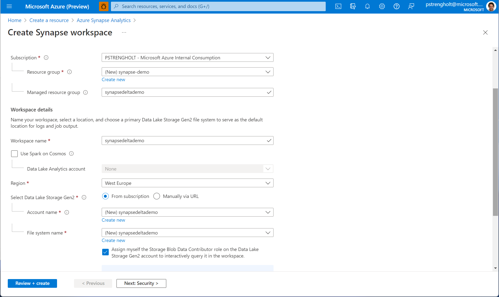

# Module 01 - Create an Azure Synapse Workspace

[< Previous Module](../modules/module01.md) - **[Home](../README.md)** - [Next Module >](../modules/module02.md)

## :thinking: Prerequisites

* An [Azure account](https://azure.microsoft.com/en-us/free/) with an active subscription.
* Your must have permissions to create resources in your Azure subscription.

## :loudspeaker: Introduction

To create and use the Azure Synapse workspace, you will need to provision an Azure Synapse account.

## :dart: Objectives

* Create an Azure Synapse account using the Azure portal.

## 1. Create an Azure Synapse Workspace

1. Sign in to the [Azure portal](https://portal.azure.com), navigate to the **Home** screen, click **Create a resource**.
2. Search the Marketplace for "Azure Synapse" and click **Create**.
3. Create a new resource group, provide a workspace name and hit **Next**.

      

4. Provide a sql username and password **Review + create**.

      

5. On the **Review + Create** tab, once the message in the ribbon returns "Validation passed", verify your selections and click **Create**.

      

6. Wait several minutes while your deployment is in progress. Once complete, click **Go to resource**.

<a href="#module-01---create-an-azure-synapse-workspace">↥ back to top</a>

## :tada: Summary

This module provided an overview of how to provision an Azure Synapse workspace using the Azure Portal.

[Continue >](../modules02/module02.md)
