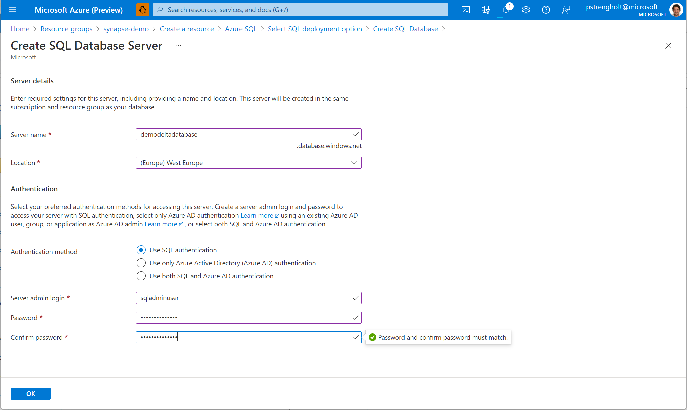
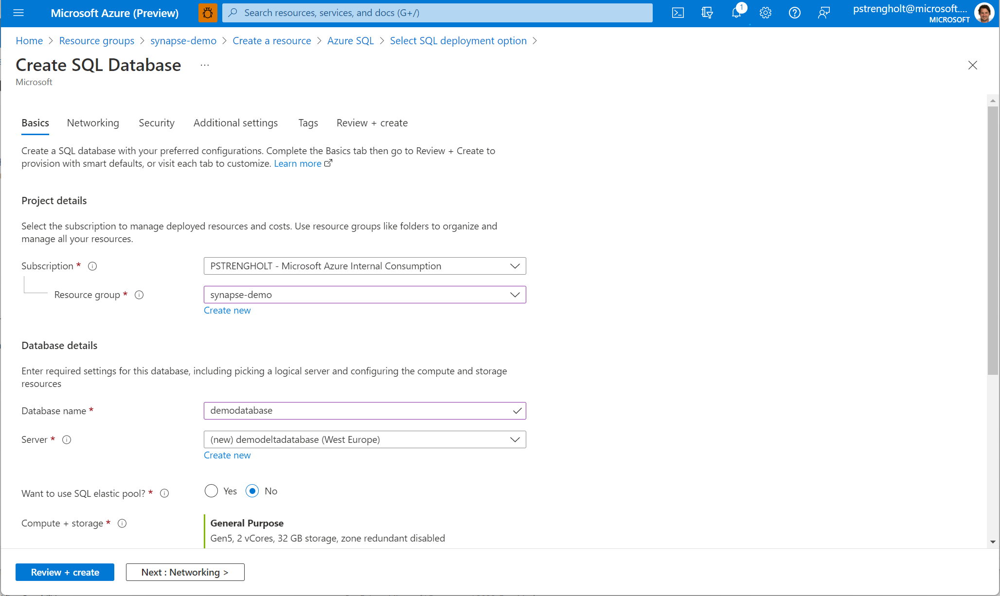

# Module 02 - Create an Azure SQL Database using AdventureWorks Sample database

[< Previous Module](../module01/module01.md) - **[Home](../README.md)** - [Next Module >](../module03/module03.md)

## :dart: Objectives

* Create an Azure SQL database using Sample content.

## 1. Create an Azure SQL database

1. Sign in to the [Azure portal](https://portal.azure.com), navigate to the **Home** screen, click **Create a resource**.
2. Search the Marketplace for "Azure SQL" and click **Create**.
3. Choose Single Database and click **Create**.

      

4. Provide a Azure SQL account name, provide a sql username and password. Click on **OK**.

      

5. On the **database** section, provide your database details. Click **Next** and navigate to the additional settings.

    

6. On the **additional settings** section, ensure the Sample database is selected. Click **Review + Create** to complete.

      

7. Wait several minutes while your deployment is in progress. Once complete, click **Go to resource**.

<a href="#module-02---create-an-azure-sql-database-using-adventureworks-sample-database">↥ back to top</a>

## :tada: Summary

This module provided an overview of how to provision an Azure SQL Database using the Azure Portal.

[Continue >](../module03/module03.md)