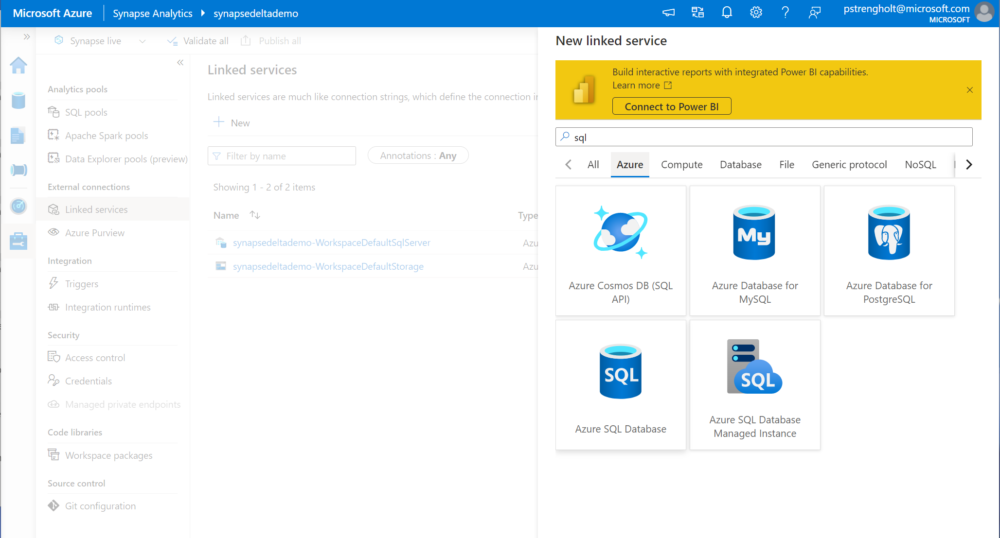
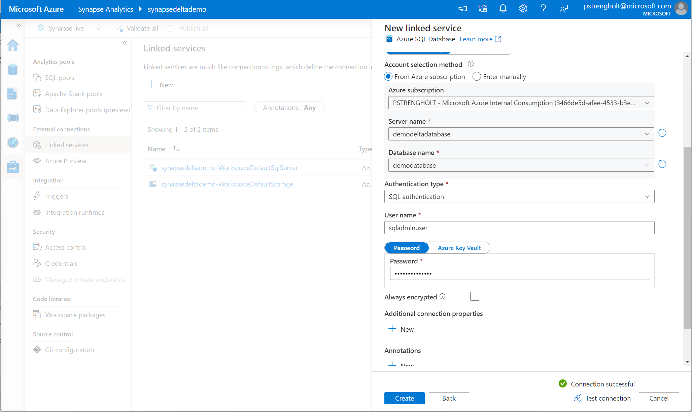
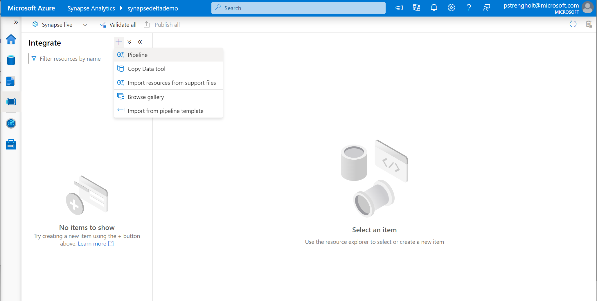
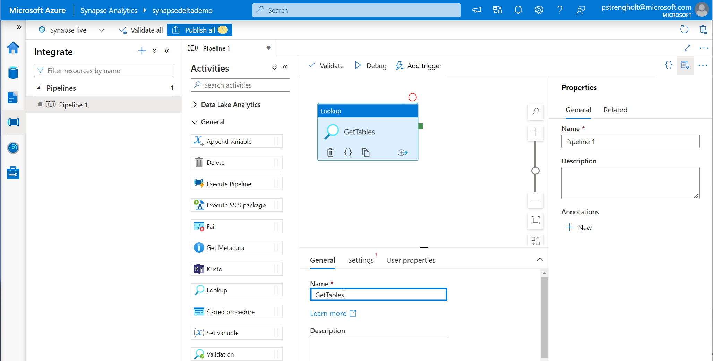
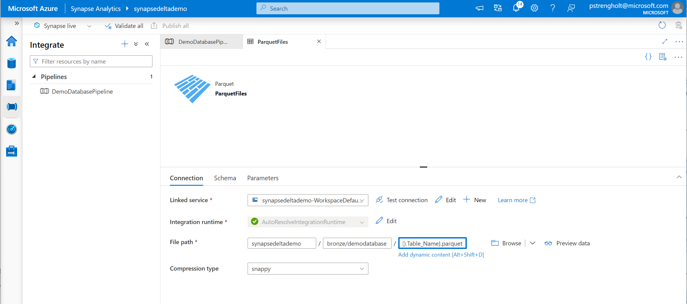

# Module 03 - Setup Data Lake, Ingest data to Bronze layer (Parquet)

[< Previous Module](../module02/module02.md) - **[Home](../README.md)** - [Next Module >](../module04/module04.md)

## :dart: Objectives

* Create folder structure for datalake.
* Allow Azure Services to access Azure SQL database.

## 1. Create Data Lake folder structure

1. Navigate to your Azure Synapse Storage Account and create three folders: **bronze**, **silver** and **gold**.

      

2. Inside each folder create a folder names: **demodatabase**.

      

3. Navigate to your Azure SQL Firewall Settings and allow Azure services to connect your Azure SQL server. Click on **Save**.

    

4. Open Synapse Studio and navigate to Linked Services under Management. Click on **New**.

      

5. Search for Azure SQL. Click on **Continue**.

    

6. Select your newly created Azure SQL database from your subscription and resource list. Provide your SQL credentials. Hit test connection and click on **Create**.

    

7. Next we will create a new Pipeline. Click on Integrate and **Create a new pipeline**.

     

8. Drag in a lookup step from the items on the left.

    

9. Under settings, select Query and copy paste the code block from below.

    `SELECT table_Schema+'.'+TABLE_NAME AS Table_Name FROM information_Schema.tables WHERE TABLE_SCHEMA = 'SalesLT' AND TABLE_TYPE = 'BASE TABLE'`

    

10. Go back to your pipeline. From the iterations, drag and drop in the ForEach step. For the items, copy paste in the code from below to fetch the results from the previous step. This becomes an argument for all the steps.

    `@activity('GetTables').output.value`

       

11. Open the ForEach step, configure the connection and define your query to execute. Use the code from the code block below.

    `SELECT * FROM @{item().Table_Name}`

    

12. Go to the Sink section of your ForEach step.

    

13. Search for Azure Data Lake Storage Gen2.

    

14. Search for Select Parquet as the target file format.

    

15. Configure the file path where the output data will be stored.

        

16. Go to your bronze folder, select demodatabase. Click **OK**. When the window closes add the following code block as the file name. This takes the table name argument and stores the output as a parquet file.

    `@{item().Table_Name}.parquet`

       

17. Publish your pipeline and Trigger your pipeline.

    

18. Find your Parquet files, click Select Top 100 and validate the results.

    

<a href="#module-03---setup-datalake">↥ back to top</a>

## :tada: Summary

This module provided an overview of how to provision an Azure SQL Database using the Azure Portal.

[Continue >](../module04/module04.md)