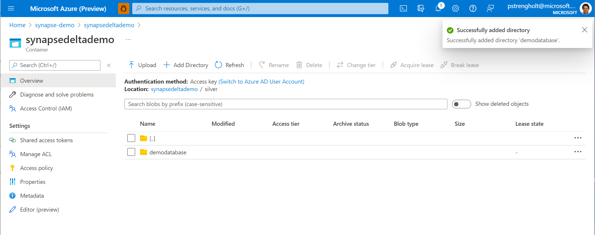
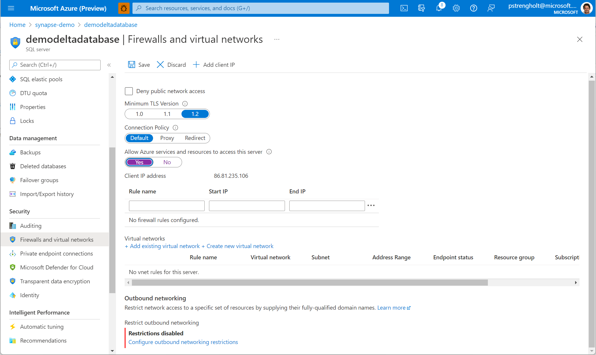
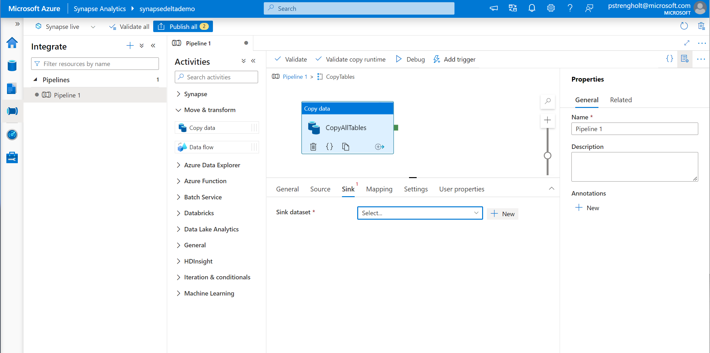
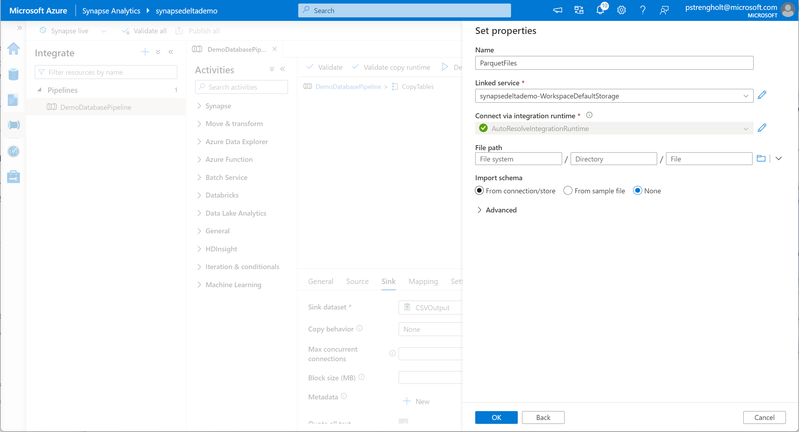

# Module 03 - Setup Data Lake, Ingest data to Bronze layer (Parquet)

[< Previous Module](../module02/module02.md) - **[Home](../README.md)** - [Next Module >](../module04/module04.md)

## :dart: Objectives

* The objective for this module is to configure your data lake structure. One of the key value proposition of a data lake is to serve data to many different data consumers from a single location. A typically pitfall of a data lake is just dumping everything into the data lake without any structure and then exposing it all consumers. The drawback of this is approach is tight-coupling and complexity: all consumers need to rework changes and transform technical structures to better consumable data. The solution for this problem is to layer your data lake by seggreating one-on-one copies (Bronze), technically standardized data (Silver) and well-constructed data (Gold). In this module we will use the same layering to demonstrate how you could design your lake. After setting up the structure, you will onboard your first source system into the Bronze layer. This is the Sample database you created in the previous module. You will use Parquet (Column Store) as the file format and Synapse Pipelines for orchestration. During this lab you will make a dynamic pipeline which first retrieves a list of tables from the databases. Next it will iterate, extract and copy table after table to your Storage Account.

## 1. Create Data Lake folder structure

1. Navigate to your Azure Synapse Storage Account and create three folders: **bronze**, **silver** and **gold**.

      

2. Inside each folder create a folder names: **demodatabase**.

      

3. Navigate to your Azure SQL Firewall Settings and allow Azure services to connect your Azure SQL server. Click on **Save**.

    

## 2. Create Linked Service

4. Open Synapse Studio and navigate to Linked Services under Management. Click on **New**.

      

5. Search for Azure SQL. Click on **Continue**.

    

6. Select your newly created Azure SQL database from your subscription and resource list. Provide your SQL credentials. Hit test connection and click on **Create**.

    

## 3. Build new pipeline

7. Next we will create a new Pipeline. Click on Integrate and **Create a new pipeline**.

     

8. Drag in a lookup step from the items on the left.

    

9. Under settings, select Query and copy paste the code block from below.

    `SELECT table_Schema+'.'+TABLE_NAME AS Table_Name FROM information_Schema.tables WHERE TABLE_SCHEMA = 'SalesLT' AND TABLE_TYPE = 'BASE TABLE'`

    

10. Go back to your pipeline. From the iterations, drag and drop in the ForEach step. For the items, copy paste in the code from below to fetch the results from the previous step. This becomes an argument for all the steps.

    `@activity('GetTables').output.value`

       

11. Open the ForEach step, configure the connection and define your query to execute. Use the code from the code block below.

    `SELECT * FROM @{item().Table_Name}`

    

12. Go to the Sink section of your ForEach step.

    

13. Search for Azure Data Lake Storage Gen2.

    

14. Search for Select Parquet as the target file format.

    

15. Configure the file path where the output data will be stored.

        

16. Go to your bronze folder, select demodatabase. Click **OK**. When the window closes add the following code block as the file name. This takes the table name argument and stores the output as a parquet file.

    `@{item().Table_Name}.parquet`

       

17. Publish your pipeline and Trigger your pipeline.

    

18. Go to data on the left. Find your storage account and navigate to your bronze layer, where you should be able to find your Parquet files. Click Select Top 100 and validate the results.

    

<a href="#module-03---setup-data-lake-ingest-data-to-bronze-layer-parquet">↥ back to top</a>

## :tada: Summary

In this module you learned about configuring your data lake structure and setting up your first data pipeline. You learned how to extract your sample database and store data as raw data in your bronze layer. More information:

- https://github.com/rukmani-msft/adlsguidancedoc/blob/master/Hitchhikers_Guide_to_the_Datalake.md

[Continue >](../module04/module04.md)