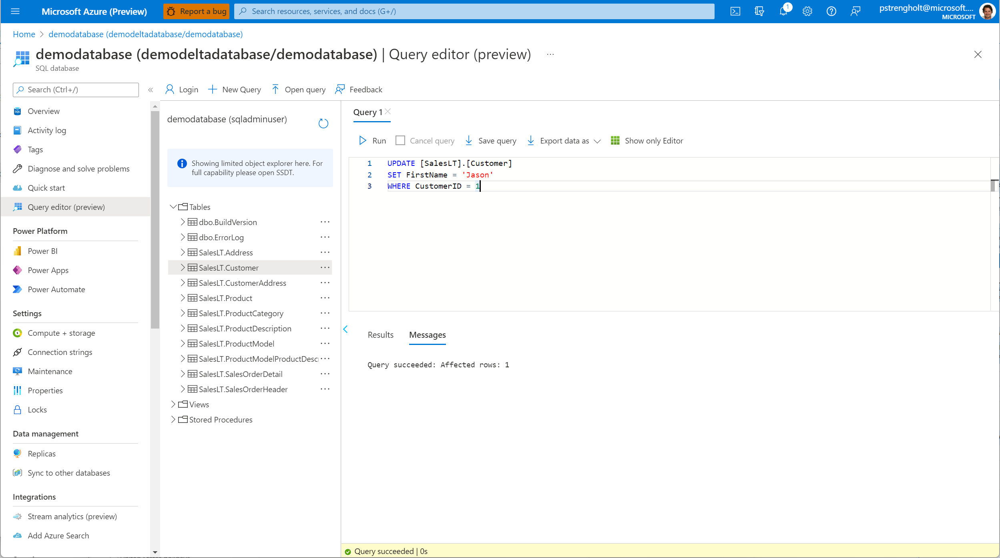

# Module 04 - Create Spark Script, Process to Silver layer (Delta)

[< Previous Module](../module03/module03.md) - **[Home](../README.md)** - [Next Module >](../module05/module05.md)

## :dart: Objectives

* The objective for this module is to move data from our bronze layer into the silver layer. In the bronze layer data typically has different file types and formats, while in the Silver layer we standardize on a fixed file format. In our example we will use Delta as the file format. Also we will use Spark to process any data.

## 1. Deploy Spark Pool and create Notebook

1. Navigate to managed environment and create a new Spark Pool.

    

2. Next go to Develop and create your first notebook: **BronzeToSilver**. For our demo pipeline you create a new notebook and start with a **parameter cell**, defining the paths for storing data. The cw_database and cw_table are for this demo pre-populated, but will be overwritten when arguments are correctly set with the database and table names. For the data itself we will use slowly changing dimensions, so each time data is changed, we will compare it with the previous dataset and add it. Within the script I've defined a section for the primary keys. Feel free to add more keys. Don't forget to replace the location of your storage account to the folder you've created!

    

    [BronzeToSilver.py](../module04/BronzeToSilver.py)

    ```python
    # Set arguments
    dfDataOriginalPath = "/bronze/"
    dfDataChangedPath = "/silver/"
    cw_database = "demodatabase"
    cw_table = "SalesLT.Address"
    ```

    ```python
    %%pyspark

    from pyspark import *
    from pyspark.sql.window import Window
    from pyspark.sql.functions import *
    from pyspark.sql import Row
    from pyspark.sql.types import StructType, StructField, IntegerType, StringType, TimestampType, BooleanType, DateType
    from typing import List
    from datetime import datetime

    print("Database: " + cw_database)
    print("Table: " + cw_table)

    # Read CSV data from landing zone location
    dataChanged = spark.read.load('abfss://synapsedeltademo@synapsedeltademo.dfs.core.windows.net/' + dfDataOriginalPath + cw_database + '/' + cw_table + '.parquet', format='parquet', header=True)
    dataChanged.printSchema()
    dataChanged.show()
    ```

    ```python
    %%pyspark

    from datetime import date
    current_date = datetime.today().date()

    from notebookutils import mssparkutils

    try:
        # Read original data - this is your scd type 2 table holding all data
        dataOriginal = spark.read.load('abfss://synapsedeltademo@synapsedeltademo.dfs.core.windows.net/' + dfDataChangedPath + "/" + cw_database + "/" + cw_table, format='delta')
    except:
        # Use first load when no data exists yet
        newOriginalData = dataChanged.withColumn('current', lit(True)).withColumn('effectiveDate', lit(current_date)).withColumn('endDate', lit(date(9999, 12, 31)))
        newOriginalData.write.format("delta").mode("overwrite").save('abfss://synapsedeltademo@synapsedeltademo.dfs.core.windows.net/' + dfDataChangedPath + "/" + cw_database + "/" + cw_table)
        newOriginalData.show()
        newOriginalData.printSchema()
        mssparkutils.notebook.exit("Done loading data! Newly loaded data will be used to generate original data.")
    ```

    ```python
    if cw_table == "SalesLT.Address":
        primaryKey = "AddressID"
    elif cw_table == "SalesLT.Customer":
        primaryKey = "CustomerID"
    else:
        mssparkutils.notebook.exit("Exit! No primary key defined!")
    ```

    ```python
    # Prepare for merge, rename columns of newly loaded data, append 'src_'
    from pyspark.sql import functions as F

    # Capture column names of incoming dataset
    columnNames = dataChanged.schema.names

    # Rename all columns in dataChanged, prepend src_, and add additional columns
    df_new = dataChanged.select([F.col(c).alias("src_"+c) for c in dataChanged.columns])
    src_columnNames = df_new.schema.names
    df_new2 = df_new.withColumn('src_current', lit(True)).withColumn('src_effectiveDate', lit(current_date)).withColumn('src_endDate', lit(date(9999, 12, 31)))
    df_new2.printSchema()

    import hashlib

    # Create dynamic columns
    src_primaryKey = 'src_' + primaryKey

    # FULL Merge, join on key column and also high date column to make only join to the latest records
    df_merge = dataOriginal.join(df_new2, (df_new2[src_primaryKey] == dataOriginal[primaryKey]), how='fullouter')

    # Derive new column to indicate the action
    df_merge = df_merge.withColumn('action',
        when(md5(concat_ws('+', *columnNames)) == md5(concat_ws('+', *src_columnNames)), 'NOACTION')
        .when(df_merge.current == False, 'NOACTION')
        .when(df_merge[src_primaryKey].isNull() & df_merge.current, 'DELETE')
        .when(df_merge[src_primaryKey].isNull(), 'INSERT')
        .otherwise('UPDATE')
    )

    df_merge.show()

    # Generate target selections based on action codes
    column_names = columnNames + ['current', 'effectiveDate', 'endDate']
    src_column_names = src_columnNames + ['src_current', 'src_effectiveDate', 'src_endDate']

    # Generate target selections based on action codes
    column_names = columnNames + ['current', 'effectiveDate', 'endDate']
    src_column_names = src_columnNames + ['src_current', 'src_effectiveDate', 'src_endDate']

    # For records that needs no action
    df_merge_p1 = df_merge.filter(df_merge.action == 'NOACTION').select(column_names)

    # For records that needs insert only
    df_merge_p2 = df_merge.filter(df_merge.action == 'INSERT').select(src_column_names)
    df_merge_p2_1 = df_merge_p2.select([F.col(c).alias(c.replace(c[0:4], "")) for c in df_merge_p2.columns])

    # For records that needs to be deleted
    df_merge_p3 = df_merge.filter(df_merge.action == 'DELETE').select(column_names).withColumn('current', lit(False)).withColumn('endDate', lit(current_date))

    # For records that needs to be expired and then inserted
    df_merge_p4_1 = df_merge.filter(df_merge.action == 'UPDATE').select(src_column_names)
    df_merge_p4_2 = df_merge_p4_1.select([F.col(c).alias(c.replace(c[0:4], "")) for c in df_merge_p2.columns])

    # Replace src_ alias in all columns
    df_merge_p4_3 = df_merge.filter(df_merge.action == 'UPDATE').withColumn('endDate', date_sub(df_merge.src_effectiveDate, 1)).withColumn('current', lit(False)).select(column_names)

    # Union all records together
    df_merge_final = df_merge_p1.unionAll(df_merge_p2).unionAll(df_merge_p3).unionAll(df_merge_p4_2).unionAll(df_merge_p4_3)

    df_merge_final.show()

    # At last, you can overwrite existing data using this new data frame
    df_merge_final.write.format("delta").mode("overwrite").save('abfss://synapsedeltademo@synapsedeltademo.dfs.core.windows.net/' + dfDataChangedPath + "/" + cw_database + "/" + cw_table)
    ```

3. When ready and tested, go back to your Pipeline, open the ForEach and drag in a Notebook Step. Select the spark pool, notebook and configure the arguments. These will be passed into our script.

    

4. Trigger the pipeline and validate the monitoring. If everything works as expected your Delta folders should be created.

     

5. Navigate to your delta folder. Right click to select top 100. Select delta as the file format, and validate the results.

    

6. Next, go back to your Azure SQL database. Select your Sample database and open the Query Editor. You should whitelist your IP-address. Update the first record:

    `UPDATE [SalesLT].[Customer] SET FirstName = 'Jason' WHERE CustomerID = 1`

    

7. Head back to your Synapse Studio, Trigger the workflow again and validate that your slowly changing dimension works as expected:

      

<div align="right"><a href="#module-04---setup-delta">↥ back to top</a></div>


## :tada: Summary

In this module module you used Spark to transform your data into Slowly Changing Dimension, stored using Delta. The Notebook you added to your pipeline.

[Continue >](../module05/module05.md)