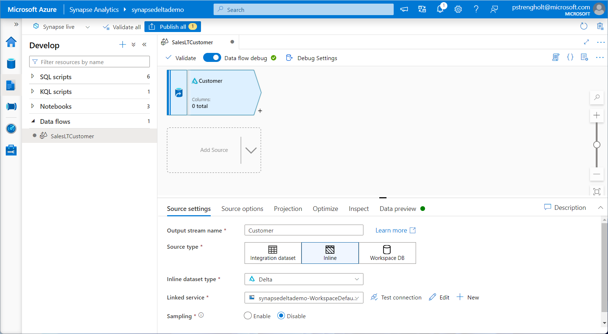

# Module 05 - Transforming data using Data Flows

[< Previous Module](../module04/module04.md) - **[Home](../README.md)** - [Next Module >](../module06/module06.md)

## :dart: Objectives

* The objective for this module is to transform data using Azure Data Flows. Data Flows is code-free solution for transforming data. It part of Synapse Analytics and can be used to perform common actions like joining, aggregating, pivoting, and sorting. As you build, you see logical dragrams and previews of your data. You use Data Flows within your data pipeline. Data flows also support parameters. This means you can design or build a reusable transformation step and reuse this across many different pipelines. The objective of this module is to show how to transform data by filtering, joining and selecting different datasets.

## 1. Transforming data using Data Flows

## 1. Open Data Flows

1. Open Synapse Studio, Navigate to Development and create a new Data Flow.

    

2. Provide a name for your newly created Data Flow. Click on Add New Source and select Inline as the source type. For the dataset type select **Delta**. For the linked service use the dropdown to select your Synapse Workspace.

    

3. Next you need to navigate to your Silver Layer. Click on the second panel named: Source Options. Navigate to your silver layer, select your demodatabase, and select **SalesLT.Customers**. Press on **OK** to close the panel.

    

4. When using Delta you also need to profile the schema. Click on the next panel called: Projection. Press on **Import Schema**, leave the options empty and click on OK. The schema should be listed now.

    

5. Next, you can preview your data. First you need to toggle the Data flow debug setting. Wait a couple of minutes till the debug environment is provisioned. Open the panel: **Data preview**, press refresh and wait for the data to appear.

    

6. For the next step you need to filter your data by selecting only the current rows. Add a new step and select Filter. For the **filter on** option, type in **current**. The current column is a boolean, which refers to true or false. You can use the **Data Preview** panel again to validate the output.

    

7. The next step is adding a join. For this you need to add another data source. Repeat the previous steps by adding your **SalesLT.CustomerAddress** dataset. Go back to your **SalesLT.Customers** and add the Join step. Select your filtered dataset as the left stream and CustomerAddres as the right stream. Select **Inner** as the join type. Finally, select CustomerID as the keys for joining the two tables. You can use the **Data Preview** panel again to validate the output.

    

8. You need to repeat the steps again for another dataset. Add another source.Repeat the previous steps by adding your **SalesLT.Address** dataset. For this dataset you also need to add a filter.

    

9. Now we will add another join. Go back to your **SalesLT.Customers** and add one more Join step. Select your previous joined dataset as the left stream. Select the newly added filtered dataset. Select **Inner** as the join type. Finally, select AddressID as the keys for joining the two tables. You can use the **Data Preview** panel again to validate the output.

    

10. Now we added all data together we need to get rid of the dupplicate column names. Add another step: Select. Remove all the dupplicate keys, such as CustomerID, AddressID, current, rowguid, effectiveDate, endDate, and so on.

    

11. At this stage we can add a Sink. This is the location to where result data is written. Select your **workspace DB** as Sink type. Select your database, in this case default, and provide a new name for your result table. Important is to publish your results using the **Publish all** button.

    

## 2. Create new pipeline

12. Now we need to create a pipeline. Go to your pipeline section, create a new pipeline. Select **Data Flow** from the Synapse Activities. Go to Settings and select your newly created Data flow. Remember to publish everything again using the **Publish all** button.

    

## 3. Explorer your results

13. Finally, it is time to trigger your pipeline. When everything is running correctly you can go to your Monitor overview and view the pipeline details.

    

14. At last, you can go to your data overview to query your newly created dataset. Select your default database from the list, right click your newly created table, and select top 100.

    

<a href="#module-05---transforming-data-using-data-flows">↥ back to top</a>

## :tada: Summary

In this module, you learned how to use a Pipeline that implements Code-free logic to do to extract, transform, and load data into an Azure Synapse Analytics table. More info:

- https://docs.microsoft.com/en-us/azure/data-factory/concepts-data-flow-overview
- https://azure.microsoft.com/nl-nl/blog/azure-data-factory-mapping-data-flows-are-now-generally-available/

[Continue >](../module06/module06.md)