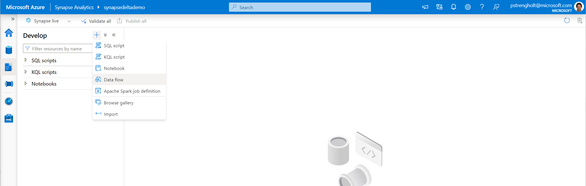
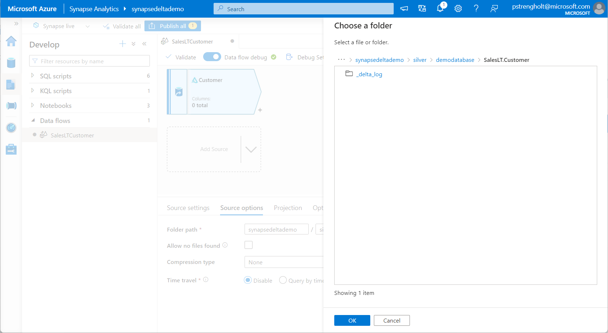
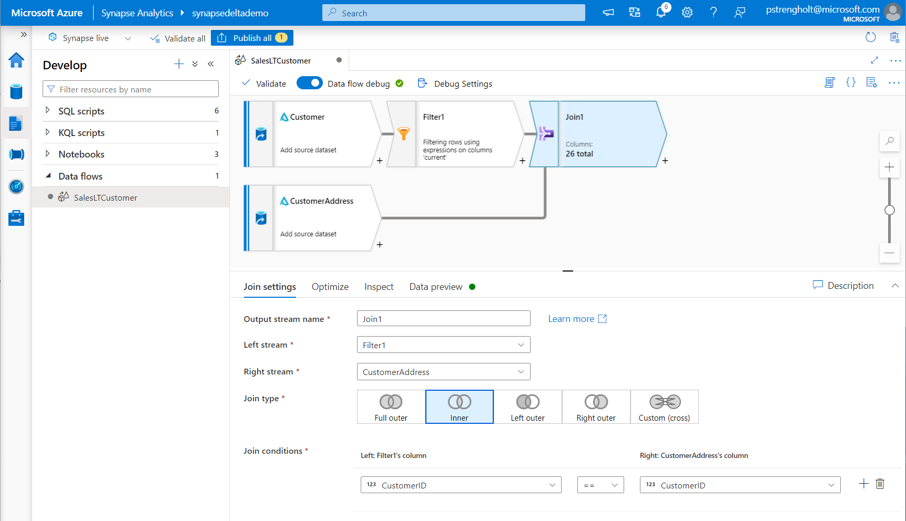

# Module 05 - Create Stored Procedures, Process to Gold layer (External table)

[< Previous Module](../module04/module04.md) - **[Home](../README.md)** - [Next Module >](../module06/module06.md)

## :dart: Objectives

* The objective for this module is to move data from the silver layer to gold layer using a stored procedure and a Serverless Pool. In this example you will use an external table format, which stored data into Parquet. You will use two stored procedures and add a delete step to the data pipeline.

## 1. Create External Tables

1. Open Synapse Studio, Navigate to Development and create a new script.

2. Create a new database using the following SQL statement: `CREATE DATABASE customers;`

3. Switch from master to your newly created database by using the following command: `USE customers;`. Alternatively you can use the dropdown menu on the right. You might need to refresh first before your new database shows up in the list.

4. In this step you will combine three datasets and create a new external table, which stored the denormalized and selected data into a new parquet file. We will first validate the results. If everything works as expected, you will wrap these statements into stored procedures and add it to your pipeline. Copy paste the following code to the newly created SQL script. Select all code and press ENTER.

      

    ```sql
    -- Create parquetfile format
    IF NOT EXISTS (SELECT COUNT(*) FROM sys.external_file_formats WHERE name = 'parquetfile')
        CREATE EXTERNAL FILE FORMAT parquetfile WITH (FORMAT_TYPE = PARQUET, DATA_COMPRESSION = 'org.apache.hadoop.io.compress.SnappyCodec')

    --Create external AzureDataLakeStore
    IF NOT EXISTS (SELECT COUNT(*) FROM sys.external_data_sources WHERE name = 'AzureDataLakeStore' )
        CREATE EXTERNAL DATA SOURCE AzureDataLakeStore WITH (LOCATION = 'https://synapsedeltademo.dfs.core.windows.net/synapsedeltademo/') 


    --Create external table CustomerAddresses
    CREATE EXTERNAL TABLE CustomerAddresses
    WITH   
        (   
            LOCATION = '/gold/demodatabase/customeraddresses',  
            DATA_SOURCE = AzureDataLakeStore,
            FILE_FORMAT = parquetfile
        )  
    AS
    SELECT
        customer.CustomerId,
        Title,
        Firstname,
        MiddleName,
        LastName,
        Suffix,
        AddressType,
        AddressLine1,
        AddressLine2,
        City,
        StateProvince,
        CountryRegion,
        PostalCode
    FROM (SELECT
        *
    FROM
        OPENROWSET(
            BULK 'https://synapsedeltademo.dfs.core.windows.net/synapsedeltademo/silver/demodatabase/SalesLT.Customer/',
            FORMAT = 'DELTA'
        ) AS [customer] WHERE [current] = 'True') AS customer
    JOIN 
    (SELECT
        *
    FROM
        OPENROWSET(
            BULK 'https://synapsedeltademo.dfs.core.windows.net/synapsedeltademo/silver/demodatabase/SalesLT.CustomerAddress/',
            FORMAT = 'DELTA'
        ) AS [CustomerAddress] WHERE [current] = 'True') AS CustomerAddress
    ON (customer.CustomerID = CustomerAddress.CustomerID)
    JOIN
    (SELECT
        *
    FROM
        OPENROWSET(
            BULK 'https://synapsedeltademo.dfs.core.windows.net/synapsedeltademo/silver/demodatabase/SalesLT.Address/',
            FORMAT = 'DELTA'
        ) AS [Address] WHERE [current] = 'True') AS Address
    ON (CustomerAddress.AddressID = Address.AddressID)
    ORDER BY customer.CustomerId
    ```

5. Head back to your storage account. Go to the gold layer, select your demo database. There should be customeraddresses folder holding parquet files with your data.

    

4. Head back to Synapse Studio. Open the data section, refresh your external tables item under your database. The customeraddresses table should be listed there. Right click and select top 100. Execute and validate everything works as expected.

     

5. Next you will drop the external table. Remove the SELECT statement and type the following: `DROP EXTERNAL TABLE CustomerAddresses;`. Refresh the external table items. Your external table should be removed.

    

6. The parquet files on your storate account will still exist. Therefore we need to modify the data pipeline to ensure also the directory and parquet files will be deleted. Drag and drop the delete action from the General section. Select your storage account and navigate to your gold layer, select your demodatabase. Under Source, select **File path in dataset**. Also ensure **Recursive** is selected.

    

    


7. Trigger the pipeline. Ensure the customeraddresses folder within your gold layer is correctly deleted.

## 2. Create Stored Procedures

8. Head back to the develop selection. We will create two stored procedures. A stored procedure is prepared set of SQL code that you can save within the database. This allows you to reuse the code over and over again. For the createCustomerAddresses use the following code block. Copy paste it in and hit execute:

    ```sql
    CREATE PROC createCustomerAddresses
    AS
    BEGIN
        BEGIN TRY
            -- Create parquetfile format
            IF NOT EXISTS (SELECT COUNT(*) FROM sys.external_file_formats WHERE name = 'parquetfile')
                CREATE EXTERNAL FILE FORMAT parquetfile WITH (FORMAT_TYPE = PARQUET, DATA_COMPRESSION = 'org.apache.hadoop.io.compress.SnappyCodec')

            --Create external AzureDataLakeStore
            IF NOT EXISTS (SELECT COUNT(*) FROM sys.external_data_sources WHERE name = 'AzureDataLakeStore' )
                CREATE EXTERNAL DATA SOURCE AzureDataLakeStore WITH (LOCATION = 'https://synapsedeltademo.dfs.core.windows.net/synapsedeltademo/') 

            --Create external table CustomerAddresses
            CREATE EXTERNAL TABLE CustomerAddresses
            WITH   
                (   
                    LOCATION = '/gold/demodatabase/customeraddresses',  
                    DATA_SOURCE = AzureDataLakeStore,
                    FILE_FORMAT = parquetfile
                )  
            AS
            SELECT
                customer.CustomerId,
                Title,
                Firstname,
                MiddleName,
                LastName,
                Suffix,
                AddressType,
                AddressLine1,
                AddressLine2,
                City,
                StateProvince,
                CountryRegion,
                PostalCode
            FROM (SELECT
                *
            FROM
                OPENROWSET(
                    BULK 'https://synapsedeltademo.dfs.core.windows.net/synapsedeltademo/silver/demodatabase/SalesLT.Customer/',
                    FORMAT = 'DELTA'
                ) AS [customer] WHERE [current] = 'True') AS customer
            JOIN 
            (SELECT
                *
            FROM
                OPENROWSET(
                    BULK 'https://synapsedeltademo.dfs.core.windows.net/synapsedeltademo/silver/demodatabase/SalesLT.CustomerAddress/',
                    FORMAT = 'DELTA'
                ) AS [CustomerAddress] WHERE [current] = 'True') AS CustomerAddress
            ON (customer.CustomerID = CustomerAddress.CustomerID)
            JOIN
            (SELECT
                *
            FROM
                OPENROWSET(
                    BULK 'https://synapsedeltademo.dfs.core.windows.net/synapsedeltademo/silver/demodatabase/SalesLT.Address/',
                    FORMAT = 'DELTA'
                ) AS [Address] WHERE [current] = 'True') AS Address
            ON (CustomerAddress.AddressID = Address.AddressID)
            ORDER BY customer.CustomerId
        END TRY
        BEGIN CATCH
            PRINT 'Error creating External table'
        END CATCH
    END
    ```

9. For the dropCustomerAddresses use the following code block. Copy paste it in and hit execute:

    ```sql
    CREATE PROC dropCustomerAddresses
    AS
    BEGIN
        BEGIN TRY
            IF EXISTS (SELECT * FROM sys.external_tables WHERE object_id = OBJECT_ID('dbo.CustomerAddresses'))
                DROP EXTERNAL TABLE dbo.CustomerAddresses
        END TRY
        BEGIN CATCH
            PRINT 'Error dropping External table'
        END CATCH
    END
    ```

10. You can now test your stored procedures by running: `EXEC createCustomerAddresses;`. Check and validate that the external table is created again. Also validate that the folder is created within your storage account. For deleting your external table you can use: `EXEC dropCustomerAddresses;`. Validate that your external table is indeed removed. You also need to remove your customeraddresses folder within your gold layer. You can do this by hand or by triggering your pipeline.

    

## 3. Update data pipeline

11. Next you will automate your stored procedures by adding these to your data pipeline. For making a connection to your SQL Serverless Pool you need to use the fully qualified domain name. Go to settings, find your serverless pool and copy paste your domain name to a clipboard:

    

12. Go back to your data pipeline. Drag and drop in **Stored Procedure** from the **General** section. In Activity Settings tab, click New to create new Linked service – here we will create connection to serverless SQL pool. In New linked service panel:

    a. Fill in Name with serverlessSQLpool
    b. Change Type to Azure Synapse Analytics (formerly SQL DW)
    c. For Account selection method choose Enter manually
    d. Fill in Fully qualified domain name with your serverless SQL pool endpoint
    e. Fill in Database with the name of the database in which you created the stored procedure population_by_year_state previously
    f. For Authentication type choose Managed Identity
    g. Click Test Connection to make sure configuration is correct
    h. Click Create to serverlessSQLpool linked service with specified options

    

13. After adding your linked service to the Serverless Pool, go back to your stored procedure step. Under Settings, select your serverless pool and the dropCustomerAddresses stored procedure. Connect your CopyTables step to this newly created stored procedure step. Connect your newly created stored procedure step to the Delete step. Create a new stored procedure step for the createCustomerAddresses stored procedure. Ensure your pipeline looks like the image below:

    

14. Trigger your pipeline. From this point you connected all data lake layers. First the raw data is pulled into the bronze layer. Next it is moved into silver in which you use a standardized file format: Delta. Also the data is versioned, so you can time-travel and fall back. Lastly you selected all 'Current' data, combined and selected, and moved the result into a gold layer.

<div align="right"><a href="#module-04---setup-delta">↥ back to top</a></div>


## :tada: Summary

In this module module you used Stored Procedures and a Serverless Pool to enrich your data. The Stored Procedures you've added to your data pipeline for managing the process end-to-end. Additional information:

- https://docs.microsoft.com/en-us/learn/modules/use-azure-synapse-serverless-sql-pools-for-transforming-data-lake/4-pool-stored-procedures-synapse-pipelines
- https://docs.microsoft.com/en-us/sql/t-sql/statements/create-procedure-transact-sql?view=sql-server-ver15

[Continue >](../module06/module06.md)