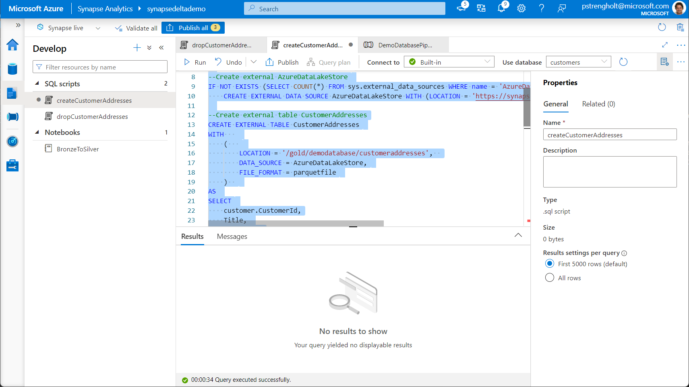

# Module 06 - Create and use a Dedicated SQL Pool

[< Previous Module](../module05/module05.md) - **[Home](../README.md)** - [Next Module >](../module07/module07.md)

## :dart: Objectives

* The objective for this module is to move data from the gold layer to a dedicated SQL pool.

## 1. Deploy Spark Pool

1. Open Synapse Studio, Navigate to Manage, SQL pools. Create a new dedicated pool.

    

2. Navigate to Development and create a new script. Select your newly created dedicated pool, and copy paste the following code:

    ```sql
    --Script for Dedicated Pool
    USE dedicated01;

    --Attach external table, which we created on the Serverless pool
    IF NOT EXISTS (SELECT * FROM sys.external_file_formats WHERE name = 'parquetfile') 
        CREATE EXTERNAL FILE FORMAT [parquetfile] 
        WITH ( FORMAT_TYPE = PARQUET)
    GO

    IF NOT EXISTS (SELECT * FROM sys.external_data_sources WHERE name = 'AzureDataLakeStore') 
        CREATE EXTERNAL DATA SOURCE [AzureDataLakeStore] 
        WITH (
            LOCATION = 'abfss://synapsedeltademo@synapsedeltademo.dfs.core.windows.net', 
            TYPE = HADOOP 
        )
    GO

    IF EXISTS (SELECT * FROM sys.external_tables WHERE object_id = OBJECT_ID('dbo.ExternalCustomerAddresses'))
        DROP EXTERNAL TABLE ExternalCustomerAddresses
    GO

    CREATE EXTERNAL TABLE ExternalCustomerAddresses (
        [CustomerId]        INT             NOT NULL,
        [Title]             VARCHAR (50)    NULL,
        [FirstName]         VARCHAR (1024)    NULL,
        [MiddleName]        VARCHAR (1024)    NULL,
        [LastName]          VARCHAR (1024)    NULL,
        [Suffix]            VARCHAR (30)    NULL,
        [AddressType]       VARCHAR (1024)    NULL,
        [AddressLine1]      VARCHAR (1024)    NULL,
        [AddressLine2]      VARCHAR (1024)    NULL,
        [City]              VARCHAR (1024)    NULL,
        [StateProvince]     VARCHAR (1024)    NULL,
        [CountryRegion]     VARCHAR (1024)    NULL,
        [PostalCode]        VARCHAR (50)    NULL
        )
        WITH (
        LOCATION = 'gold/demodatabase/customeraddresses',
        DATA_SOURCE = [AzureDataLakeStore],
        FILE_FORMAT = [parquetfile]
        )
    GO
    ```

    The script is similar to the script you've used for your Serverless Pool. You can test your external table by running the following SQL Statement: `SELECT * FROM ExternalCustomerAddresses;`

<div align="right"><a href="#module-04---setup-delta">↥ back to top</a></div>


## :tada: Summary

In this module module you used Stored Procedures and a Serverless Pool to enrich your data. The Stored Procedures you've added to your data pipeline for managing the process end-to-end. Additional information:

- https://docs.microsoft.com/en-us/learn/modules/use-azure-synapse-serverless-sql-pools-for-transforming-data-lake/4-pool-stored-procedures-synapse-pipelines
- https://docs.microsoft.com/en-us/sql/t-sql/statements/create-procedure-transact-sql?view=sql-server-ver15

[Continue >](../module04/module04.md)