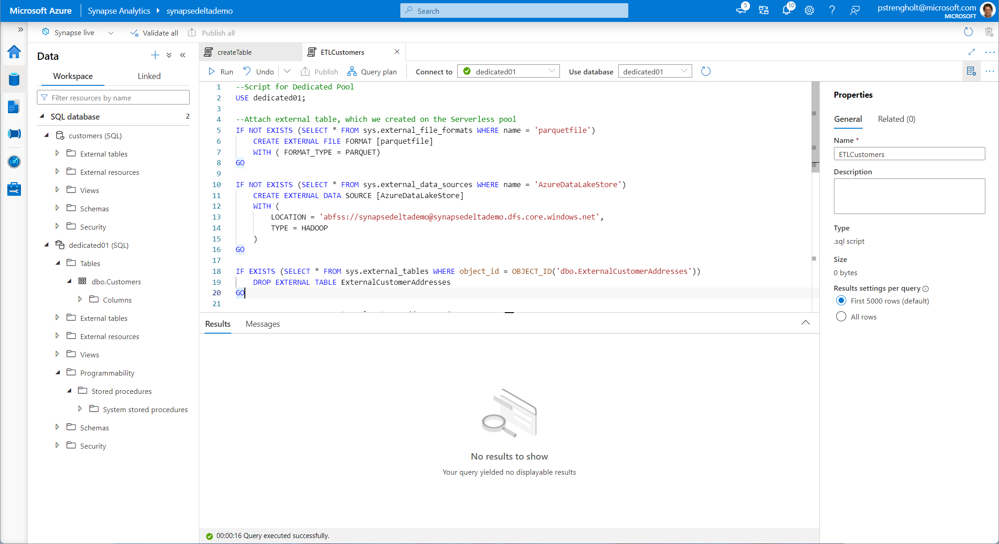
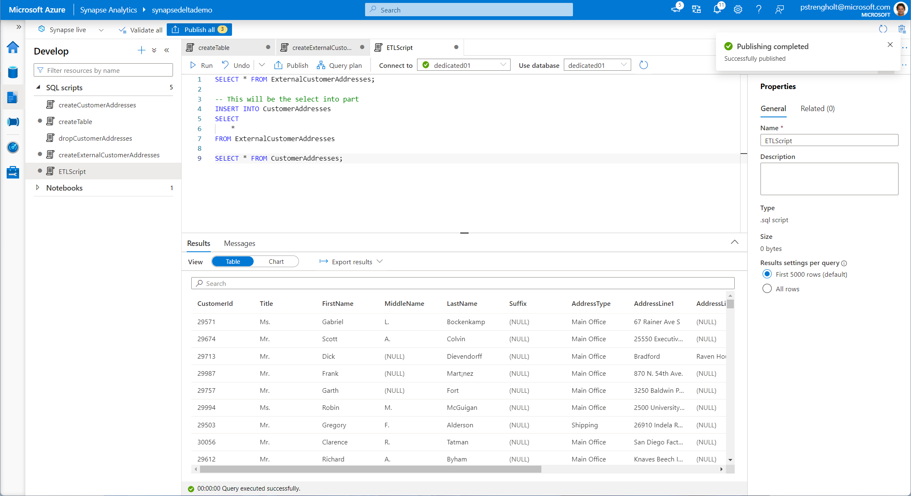

# Module 07 - Analyze data using Azure Synapse Data Explorer

[< Previous Module](../module06/module06.md) - **[Home](../README.md)** - [Next Module >](../module08/module08.md)

## :dart: Objectives

* The objective for this module is to analyze data using Azure Synapse Data Explorer, which provides customers with an interactive query experience to unlock insights from log and telemetry data. To complement existing SQL and Apache Spark analytics runtime engines, the Data Explorer analytics runtime is optimized for efficient log analytics using powerful indexing technology to automatically index free-text and semi-structured data commonly found in telemetry data.In this exercise we will use Spark to generate over 1.3 billion rows of data with randomized data. This data you'll push into Azure Data Explorer for later analysis.

## 1. Deploy Kusto Pool

1. Open Synapse Studio, Navigate to Manage, Kusto Pools. Create a new Kusto Pool.

    

## 2. Generate random data

2. Navigate to Development and create a new Notebook. Select the Spark Pool, and copy paste the following code:

    ```python
    #Generate Random Data
    from pyspark import SparkContext
    from pyspark.sql import SparkSession
    from datetime import datetime, timedelta
    import pandas as pd
    from pandas.tseries.offsets import BDay
    import pyspark.sql.functions as F
    from pyspark.sql.functions import col, coalesce, lit
    from pyspark.sql.types import DoubleType
    import random

    daterange=pd.date_range("1900-01-01", "2150-01-01", freq='D')
    bdaterange=pd.date_range("1900-01-01", "2150-01-01", freq='B') 
    bmdaterange=pd.date_range("1900-01-01", "2150-01-01", freq='BM')
    daily = pd.DataFrame(index=daterange,columns=['serial'])
    bdaily = pd.DataFrame(index=bdaterange,columns=['wserial'])
    bme = pd.DataFrame(index=bmdaterange,columns=['bmeserial'])
    daily['serial'] = range(2, 2+len(daily.index))
    bdaily['wserial'] = range(1, 1 + len(bdaily.index))
    bme['bmeserial'] = True
    bdaily2 = bdaily.reset_index()
    daily2 = daily.reset_index()
    bme2 = bme.reset_index()
    bdaily_spark = spark.createDataFrame(bdaily2)
    daily_spark = spark.createDataFrame(daily2)
    bme_spark = spark.createDataFrame(bme2)

    alldates = (
    daily_spark
    .join(bdaily_spark, on="index", how='left')
    .join(bme_spark, on="index", how='left')
    .withColumn('Date', col("index").cast('date'))
    .select('Date', 'Serial', 'WSerial', coalesce(col('bmeserial'), lit(False)).alias('MonthEnd'))
    .withColumn("serial", col("serial").cast("int"))
    .withColumn("wserial", col("wserial").cast("int"))
    ).cache()

    dates = (
    alldates
    .where("date<='2021-11-05'")
    .orderBy(col("date").desc())
    .limit(261*5)
    .select("date").cache()
    )

    secids = ( spark.createDataFrame(
        [[x] for x in range(10000)],
        ["secid"]
    )
    .withColumn("secid", col("secid")
    .cast("int"))
    .cache()
    )

    dataitems = ( spark.createDataFrame(
        [[x] for x in range(100)],
        ["varid"]
    )
    .withColumn("varid", col("varid")
    .cast("int"))
    .cache()
    )

    def getRand():
    return random.uniform(-1, 1)
    udfgetRand = F.udf(getRand, DoubleType())
    vardata = secids.crossJoin(dates).crossJoin(dataitems).withColumn("value", udfgetRand()).cache()

    vardata.count()
    ```

    

3. Run the code and wait for a couple of minutes. The script creates more than 1.3 billion rows of data with randomized data.

## 3. Transfer data into Kusto

4. If everything works as expected, go back to your Data Explorer Pool and lookup the connection details. Copy the Query endpoint to a clipboard.

    

5. Head back to your Notebook. Add two new code blocks. The first codeblock stores all data into a external table. The second code block writes all data to your newly created Kusto Pool. You need to adjust the **spark.synapse.linkedService** and **kustoCluster** options. The linkedService is the name of your pool. The kustoCluster is the query endpoint from your clipboard.

    ```python
    %%pyspark
    spark.sql("CREATE DATABASE IF NOT EXISTS random")
    vardata.write.mode("overwrite").saveAsTable("random.vardata")
    ```

    ```python
    vardata.write \
        .format("com.microsoft.kusto.spark.synapse.datasource") \
        .option("spark.synapse.linkedService", "kustopool001") \
        .option("kustoCluster", "https://kustopool001.synapsedeltademo.kusto.azuresynapse.net") \
        .option("kustoDatabase", "imkustodb") \
        .option("kustoTable", "vardata") \
        .option("tableCreateOptions","CreateIfNotExist") \
        .mode("Append") \
        .save()
    ```

6. Next you need to create a new Data Explorer database. Go to the data section, click on the + symbol, choose Create new Data Explorer Database. The new database name should match the **kustoDatabase** option in the script, which in your case is: `imkustodb`.

    

7. When ready, execute the last code blocks of your Python script. This part will take a while. When ready, you should see the newly created **vardata** table under your newly created database.

    

## 4. Analyze your data

8. Next, you can open your Data Explorer Database and start writing some Kusto queries to analyze your data. Right click to open your database.

    

9. Open your database and copy paste the following code from below:

    ```kusto
    //Example query A: given one date, show all data restricted to that date
    vardata
    | where ['date']  == '2021-11-05T00:00:00.0000000'

    //Example query B: given one secid, show all data restricted to that secid
    vardata
    | where secid == '5'

    //Example query C: given one date and one varid, show all data restricted to that date and varid
    vardata
    | where  ['date'] == '2021-11-05T00:00:00.0000000' and varid == 13

    //Example query D: given one secid and one varid, show all data restricted to that secid and varid
    vardata
    | where  secid == '2048' and varid == 85

    //Example query E: same as A, but pivoted. This means that each varid becomes one column and the rows have only secid as key
    vardata
    | where ['date'] == '2021-01-05T00:00:00.0000000'
    | project secid, varid
    | evaluate pivot(varid)

    //Example query F: same as B, but pivoted. This means that each varid becomes one column and the rows have only date as key
    vardata
    | where secid == '2048'
    | project ['date'],varid
    | evaluate pivot(varid)
    ```

8. Execute some of these queries to see how fast Data Explorer is able to process your data. Remember, you're querying more than 1.3 billion rows of data!

    

9. The same queries you can also execute from your Synapse Studio. Go to Develop, click new KSQL Script, and copy paste the contents from Data Explorer.

    

<div align="right"><a href="#module-07---analyze-data-using-azure-synapse-data-explorer">↥ back to top</a></div>


## :tada: Summary

In this module module you learned how to provision and use a Data Explorer Database. You learned to ingest data from a Spark Notebook. You also learned how to use Kusto queries for analyzing your data. Additional information:

- https://docs.microsoft.com/en-us/azure/data-explorer/
- https://docs.microsoft.com/en-us/azure/data-explorer/kusto/query/

[Continue >](../module08/module08.md)