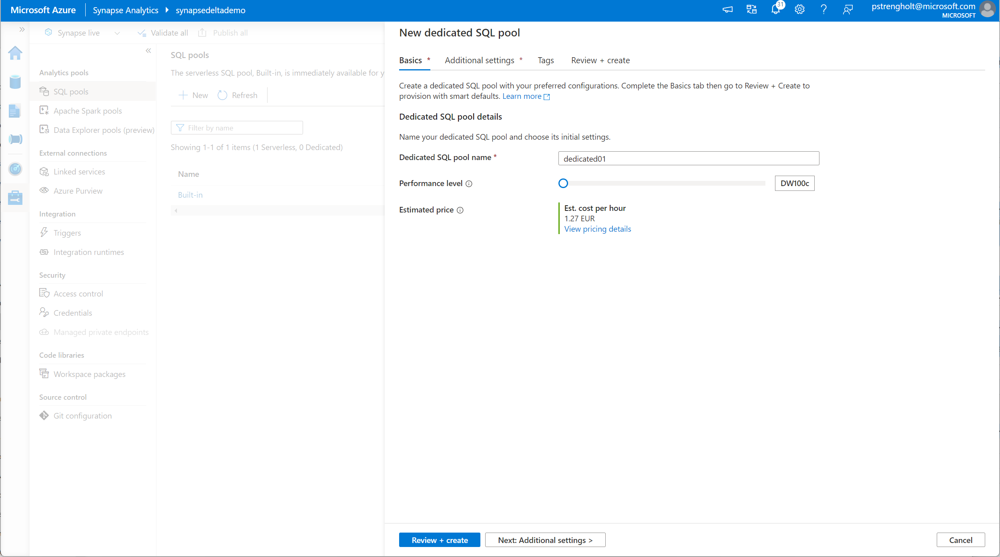

# Module 07 - Create and use a Dedicated SQL Pool

[< Previous Module](../module06/module06.md) - **[Home](../README.md)** - [Next Module >](../module08/module08.md)

## :loudspeaker: Introduction

The objective for this module is to move data from the gold layer to a powerful MPP (Massively Parallel Processing) distributed query engine: Dedicated SQL pool. Dedicated Pools, contrasting to Serverless Pools, store data in their own storage layer and are a good for workloads that require strong performance. Serverless Pools, as you learned in the previous labs, don't have their own database. They read data from the storage accounts. Data in dedicated pools is distributed over many shards using different distribution patterns: replicated, hash or round-robin. In this lab you'll use a clustered columnstore index to replicate a table over many nodes using a column key. 

## :dart: Objectives

* Deploy a dedicated pool.
* Create a script for copying data from the gold layer to a dedicated pool
* Query data from your dedicated pool tables

## 1. Deploy Dedicated Pool

1. Open Synapse Studio, Navigate to Manage, SQL pools. Create a new dedicated pool.

    

2. Navigate to Development and create a new script. Select your newly created dedicated pool, and copy paste the following code:

    ```sql
    --Script for Dedicated Pool
    USE dedicated01;

    --Attach external table, which we created on the Serverless pool
    IF NOT EXISTS (SELECT * FROM sys.external_file_formats WHERE name = 'parquetfile') 
        CREATE EXTERNAL FILE FORMAT [parquetfile] 
        WITH ( FORMAT_TYPE = PARQUET)
    GO

    IF NOT EXISTS (SELECT * FROM sys.external_data_sources WHERE name = 'AzureDataLakeStore') 
        CREATE EXTERNAL DATA SOURCE [AzureDataLakeStore] 
        WITH (
            LOCATION = 'abfss://synapsedeltademo@synapsedeltademo.dfs.core.windows.net', 
            TYPE = HADOOP 
        )
    GO

    IF EXISTS (SELECT * FROM sys.external_tables WHERE object_id = OBJECT_ID('dbo.ExternalCustomerAddresses'))
        DROP EXTERNAL TABLE ExternalCustomerAddresses
    GO

    CREATE EXTERNAL TABLE ExternalCustomerAddresses (
        [CustomerId]        INT             NOT NULL,
        [Title]             VARCHAR (50)    NULL,
        [FirstName]         VARCHAR (1024)    NULL,
        [MiddleName]        VARCHAR (1024)    NULL,
        [LastName]          VARCHAR (1024)    NULL,
        [Suffix]            VARCHAR (30)    NULL,
        [AddressType]       VARCHAR (1024)    NULL,
        [AddressLine1]      VARCHAR (1024)    NULL,
        [AddressLine2]      VARCHAR (1024)    NULL,
        [City]              VARCHAR (1024)    NULL,
        [StateProvince]     VARCHAR (1024)    NULL,
        [CountryRegion]     VARCHAR (1024)    NULL,
        [PostalCode]        VARCHAR (50)    NULL
        )
        WITH (
        LOCATION = 'gold/demodatabase/customeraddresses',
        DATA_SOURCE = [AzureDataLakeStore],
        FILE_FORMAT = [parquetfile]
        )
    GO
    ```

    

    The script is similar to the script you've used for your Serverless Pool. You can test your external table by running the following SQL Statement: `SELECT * FROM ExternalCustomerAddresses;`

3. Next you should create another script. This time for your target table. The table will be used within the dedicated pool using a HASH distribution method. This means your data will be distributed over 60 nodes using the CustomerId column.

    ```sql
    CREATE TABLE [dbo].[CustomerAddresses] (
        [CustomerId]        INT             NOT NULL,
        [Title]             VARCHAR (50)    NULL,
        [FirstName]         VARCHAR (1024)    NULL,
        [MiddleName]        VARCHAR (1024)    NULL,
        [LastName]          VARCHAR (1024)    NULL,
        [Suffix]            VARCHAR (30)    NULL,
        [AddressType]       VARCHAR (1024)    NULL,
        [AddressLine1]      VARCHAR (1024)    NULL,
        [AddressLine2]      VARCHAR (1024)    NULL,
        [City]              VARCHAR (1024)    NULL,
        [StateProvince]     VARCHAR (1024)    NULL,
        [CountryRegion]     VARCHAR (1024)    NULL,
        [PostalCode]        VARCHAR (50)    NULL
    )
    WITH (CLUSTERED COLUMNSTORE INDEX, DISTRIBUTION = HASH([CustomerId]));
    ```

    

4. Next you can transfer data from your external table into your newly created table within the dedicated pool. Run the following code to select all data from your external table and insert it into your table within the dedicated pool.

    ```sql
    -- This will be the select into part
    INSERT INTO CustomerAddresses
    SELECT
        *
    FROM ExternalCustomerAddresses
    ```

    You can query your data using the following statement: `SELECT * FROM CustomerAddresses;`

    

<div align="right"><a href="#module-07---create-and-use-a-dedicated-sql-pool">↥ back to top</a></div>


## :tada: Summary

In this module module you learned how to provision and use a dedicated SQL Pool. You learned to copy data from an external table into a new data in your dedicated pool. Additional information:

- https://docs.microsoft.com/en-us/azure/synapse-analytics/sql-data-warehouse/sql-data-warehouse-overview-what-is
- https://docs.microsoft.com/en-us/azure/synapse-analytics/sql-data-warehouse/sql-data-warehouse-tables-distribute

[Continue >](../module08/module08.md)