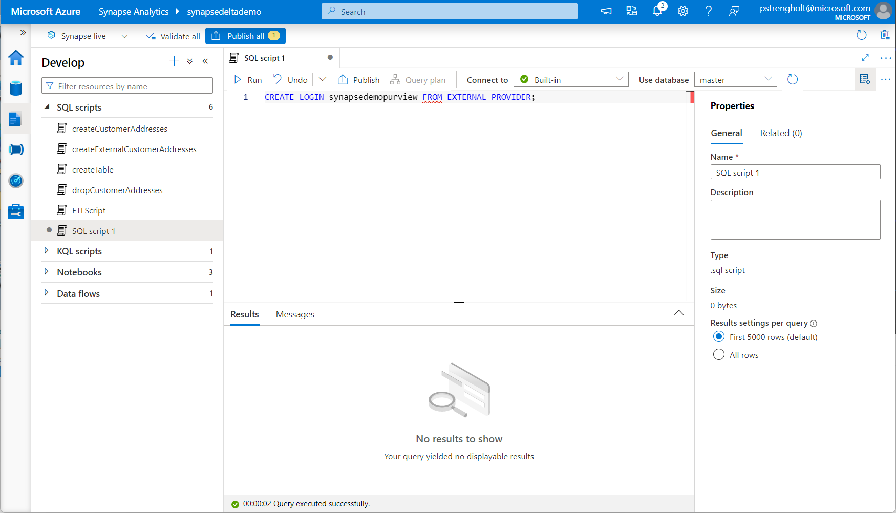
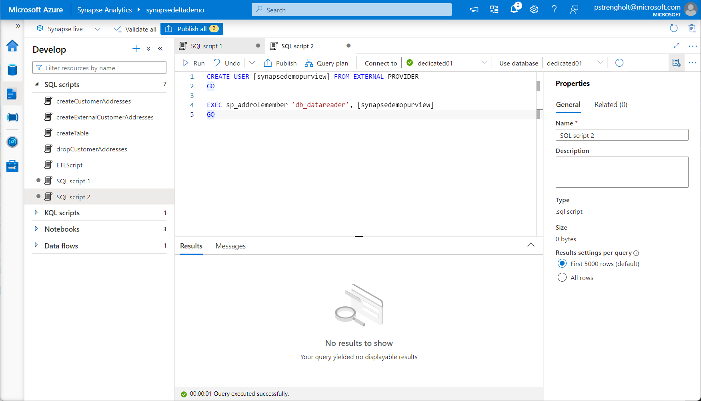
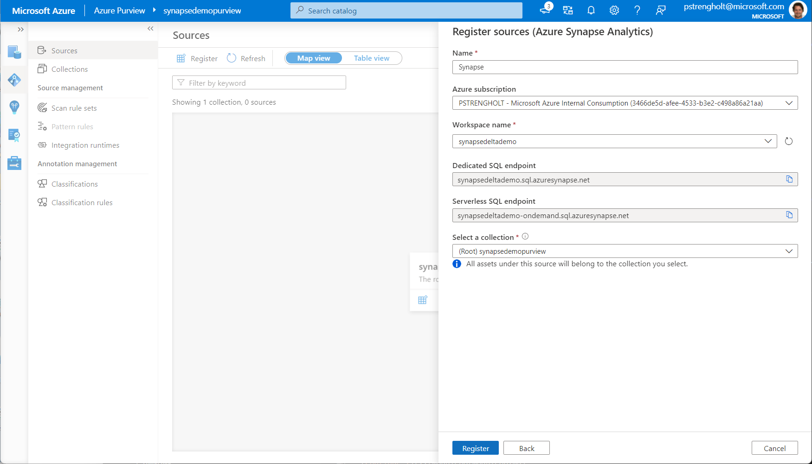
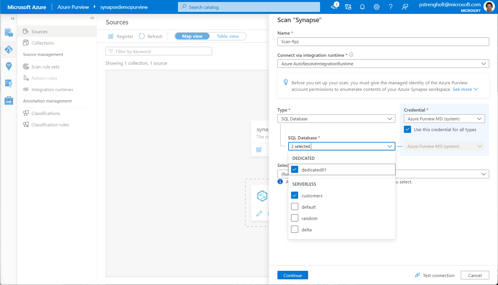
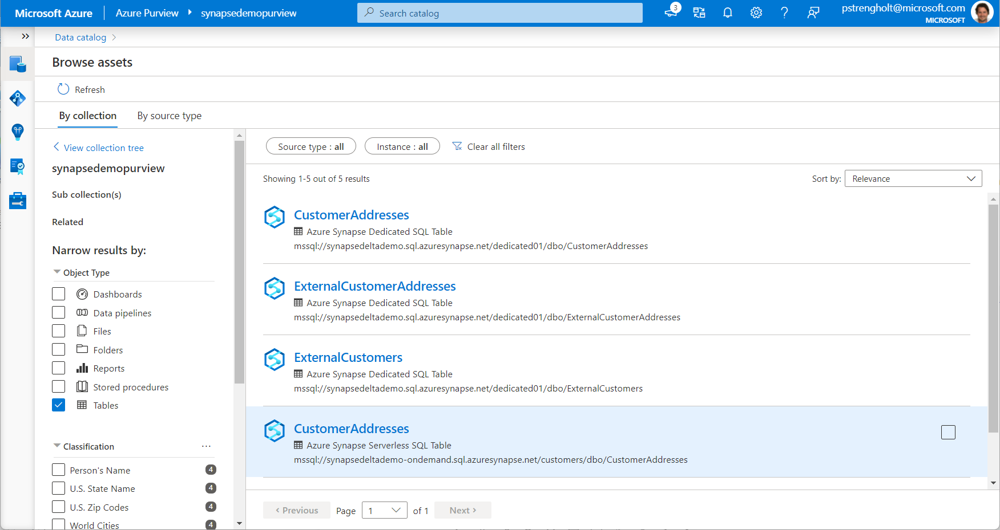
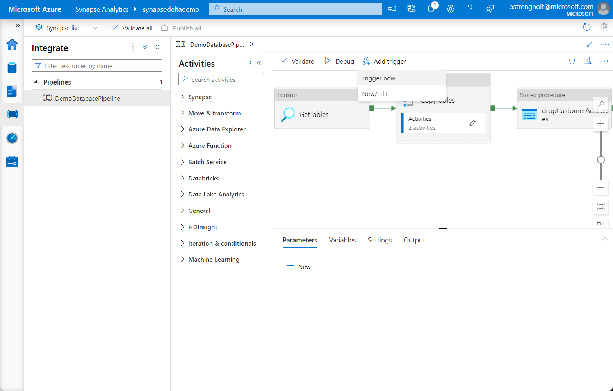

# Module 09 - Data governance with Azure Purview

[< Previous Module](../module08/module08.md) - **[Home](../README.md)** - [Next Module >](../module10/module10.md)

## :dart: Objectives

* The objective for this module is to govern and scan your data using Azure Purview, which is a unified data governance solution that helps you manage and govern your on-premises, multicloud, and software-as-a-service (SaaS) data. Purview enables you to easily create a holistic, up-to-date map of your data landscape with automated data discovery, sensitive data classification, and end-to-end data lineage. It also enables data consumers to find valuable, trustworthy data.

## 1. Deploy Azure Purview

## 1. Create an Azure Purview Workspace

1. Sign in to the [Azure portal](https://portal.azure.com), navigate to the **Home** screen, click **Create a resource**.
2. Search the Marketplace for "Azure Purview" and click **Create**.
3. Create a new resource group, provide a workspace name and hit **Next**.

    

## 2. Explore the integration of Azure Purview into the Azure Synapse Analytics workspace

4. Open Synapse Analytics Studio, and then navigate to the Manage hub.
5. Select Azure Purview to view the details of the connected Azure Purview workspace

    

6. This connection of Synapse and Purview enables two categories for functionalities: 1) Data Catalog integration which allows the discovery of assets using Purview powered search. 2) Data Lineage integration which allows automatic data lineage collection for Synapse Pipelines.

    


## 3. Connect Azure Purview to the Azure Synapse Analytics workspace

7. For connecting your Azure Synapse Workspace to Purview you need to configure the authentication on three different places: The Azure Synapse workspace, the associated storage, and the Azure Synapse databases. First, in the Azure portal, go to the Azure Synapse workspace resource. On the left pane, select Access Control (IAM).

    

8. Select the Add button. Set the **Reader** role and enter your Azure Purview account name, which represents its managed service identity (MSI). Select Save to finish assigning the role.

    

9. You must follow the same steps for the Storage Account, associated with your Azure Synapse workspace. Go to your Storage Account, on the left pane, select Access Control (IAM). Select the Add button. Set the **Storage blob data reader** role and enter your Azure Purview account name (which represents its MSI) in the Select box. Select Save to finish assigning the role.

10. Next you need to give access to your Azure Synapse serverless database. Go to your Azure Synapse workspace and open the Synapse Studio. Select the Data tab on the left menu. Select the ellipsis (...) next to one of your databases, and then start a new SQL script. Add the Azure Purview account MSI (represented by the account name) on the serverless SQL databases. You do so by running the following command in your SQL script: `CREATE LOGIN [PurviewAccountName] FROM EXTERNAL PROVIDER;`

11. Execute the script by selecting your **master** database.

    

12. For your other Serverless databases another step is required. Create another SQL script. Select the serverless database you would like to scan, for example, customers. Copy paste the code from below and execute the script.

    ```sql
    CREATE USER [PurviewAccountName] FOR LOGIN [PurviewAccountName];
    ALTER ROLE db_datareader ADD MEMBER [PurviewAccountName];
    ```

    

13. For your Azure Synapse dedicated database the code looks slightly different. Create another SQL script. Copy paste the code from below and replace the Azure Purview account MSI (represented by the account name):

    ```sql
    CREATE USER [PurviewAccountName] FROM EXTERNAL PROVIDER
    GO

    EXEC sp_addrolemember 'db_datareader', [PurviewAccountName]
    GO
    ```

    

14. Next you can register your Synapse Workspace in Purview. Go to your Azure Purview account. On the left pane, select Sources. Select Register. Under Register sources, select Azure Synapse Analytics (multiple). Select Continue.

    

15. On the Register sources (Azure Synapse Analytics) page, enter a Name for the data source to be listed in the data catalog. You must also choose your subscription to filter down to and select your workspace name. Select Register to finish registering the data source.

    

16. For a new scan, click your newly added Synapse Workspace. Select Scan.

    

17. On the Scan details pane, in the Name box, enter a name for the scan. In the Type dropdown list, select the types of resources that you want to scan within this source. SQL Database is the only type we currently support within an Azure Synapse workspace. Select you dedicated01 and customer database. Select Continue to proceed.

    

18. Select Scan rule sets of type Azure Synapse SQL. You can also create scan rule sets inline. Choose your scan trigger. You can schedule it to run weekly/monthly or once. Review your scan, and then select Save to complete the setup. If everything works as expected you should go the Data Map tab under the left pane. Select the your Synapse data source. You will see a list of all your new assets.

    

## 3. Azure Purview powered search

19. Now it's time to go back to your Synapse Workspace. Open Synapse Analytics Studio, and then navigate to the Data hub. Select the search bar at the top and make sure Purview is selected as the search provider. Enter **customer** in the search box and notice the asset suggestions returned. Select View search results to view the results of the Purview-powered search. You can explore any of the results of the search. Select the an asset to see more:

    

20. Next, you will trigger the execution of a Synapse Pipeline to generate data lineage information in the Purview workspace. Navigate to the Integrate hub and trigger your pipeline. The pipeline will take up to 20 minutes to complete. You will proceed to the next tasks and come back later to Purview to check the lineage data generated by the execution of the pipeline.

    

<div align="right"><a href="#module-09---data-governance-with-azure-purview">↥ back to top</a></div>

## :tada: Summary

In this module module you learned how to provision and use a Azure Purview. You explored how Purview can scan Synapse Analytics workspaces and also how Synapse Pipelines automatically generate lineage data in the Purview workspace. More information:

- https://docs.microsoft.com/en-us/azure/purview/
- https://docs.microsoft.com/en-us/azure/purview/register-scan-synapse-workspace
- https://github.com/tayganr/purviewlab

[Continue >](../module10/module10.md)