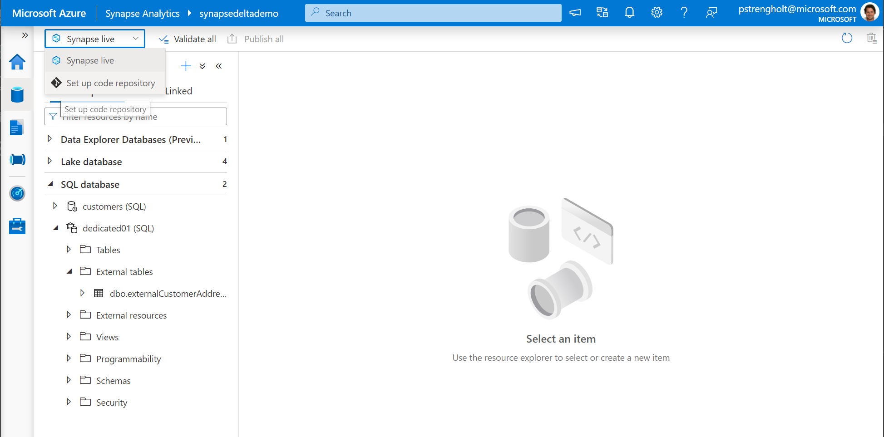
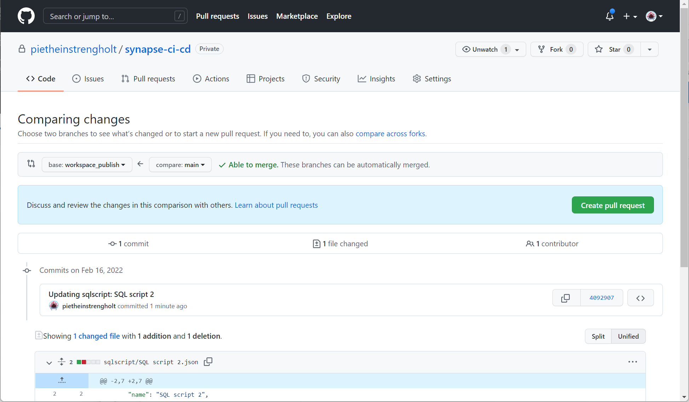
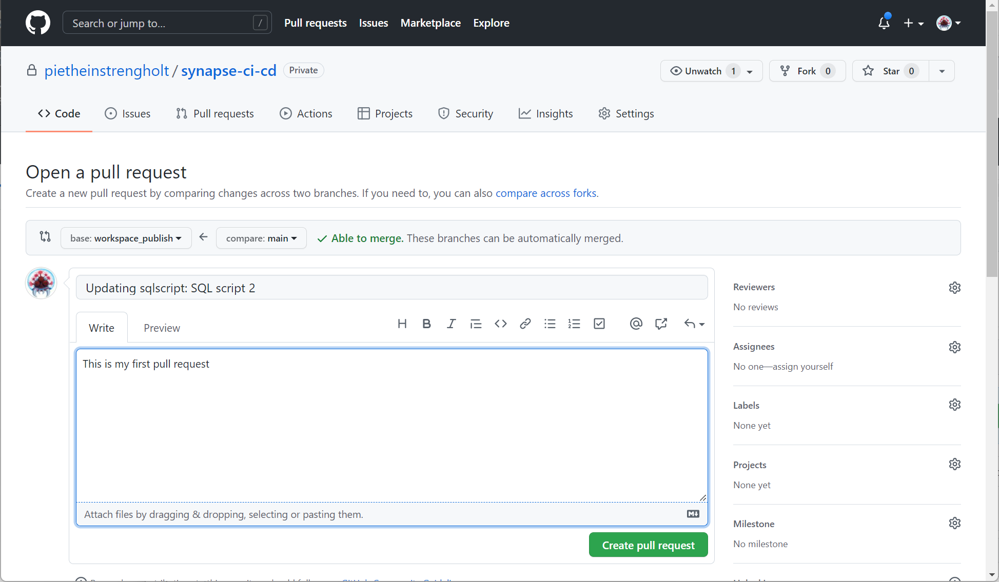

# Module 10 - Implement version control using Git

[< Previous Module](../module09/module09.md) - **[Home](../README.md)**

## :loudspeaker: Introduction

The objective for this module is to implement version control for managing your code using a code repository. The goal of this is to deliver working functionality to users more quickly and frequently.

For Synapse you can associate your workspace with a Git repository, Azure DevOps, or GitHub. Typically you create different branches. This is a pointer or snapshot of your code. Such a branch is connected to workspace, which allows you to separate your development activities from your production workload. When making changes you use pull requests to move code from branches to branches. Such a pull request can also trigger a workflow. For example, you can ask someone else to validate your code changes or trigger an integration process to check breaking functionality and code quality.

## :dart: Objectives

* Create GitHub repository
* Link your Azure Synapse Analytics workspace to GitHub
* Create pull request

## 1. Create GitHub repository

## 1. Create a new repository

1. Sign in to [GitHub](https://www.github.com), navigate to the **Repositories** screen, click **New**. If you don't have a GitHub account or repository, follow [these instructions](https://github.com/join) to create your resources.
2. Enter a new name for your repository. In this example you will be using **synapse-ci-cd**. Also check the box for creating a Readme file. Click **Create repository** for creating a new code repository.

    

    

## 2. Link your Azure Synapse Analytics workspace to GitHub

3. Open Synapse Analytics Studio, and then navigate to Develop.
4. Click on Synapse live and select **Set up code repository**.

    

5. Select GitHub and enter the repository owner name. This is your GitHub username.

    

6. Select your **synapse-ci-cd** repository from the list. Choose main as the collaboration branch. Check the import existing code checkbox. Choose to import your code into main.

    

## 3. Create pull request

7. Next, you need to make a change to any of your scripts. Open any and change some code. Press the publish button at the top.

    

8. Next, you will make a pull request. After you have done this you will be redirected to GitHub. Select the workspace_publish and compare it with the main branch. Click on Create Pull request

    

    

9. In this screen you have to option to provide additional details. The comment box is helpful for other users to understand what changes have been made. Click on Create Pull Request when ready.

    

10. You can press merge pull request to merge in the code from the main branch into workspace_publish branch.

    

<a href="#module-10---implement-version-control-using-git">↥ back to top</a>

## :tada: Summary

In this module module you learned how to use version control for your code. You linked Azure Synapse to GitHub and created a pull request for publishing newly created code. for More information:

- https://docs.microsoft.com/en-us/azure/synapse-analytics/cicd/source-control